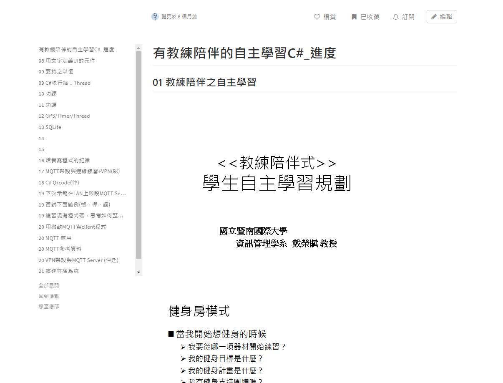
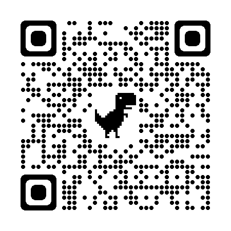

在大二下時，參與了人文社會與科技前瞻人才培育計畫( UFO 計畫)，由資管系戴榮賦主任親自帶領的教授的自主學習社群。在精進軟體開發技能同時，也學會協作與溝通能力，以及透過教授有系統性的安排下，進行更有效的學習規劃，其中學生主要學習：
- 撰寫 C# 語言
- 學習MQTT 協定基礎架構與實作
- 了解App 運作生命週期 
- 撰寫 Xamarin 應用程式
- 培養實務討論
- 人機互動分析與創新思維
- 系統開發

:::tip 感想心得
每週例行性的開會兩次，學會的不只有打程式，在與同學共同處理問題時，也學會如何表達自己的想法，重述與摘要別人說話的重點，並且透過線上協作編輯工具 HackMD 的幫助，將所學的資料以及問題放置網頁上與團隊一同分享，了解問題的根本，進一步尋找解決方案。
曾經我因MQTT 連不上 broker 而苦惱，但透過例行性開會和同學師長討論，最後終於發現是因為非同步程式設計的問題時，除了成功開啟 broker ，同時也建立了自信心與朋友的並肩共戰的感情，深刻體悟了教授一開始所倡導的「以文會友，培養同窗情誼」。
:::
:::info
## 作品影片連結

:::