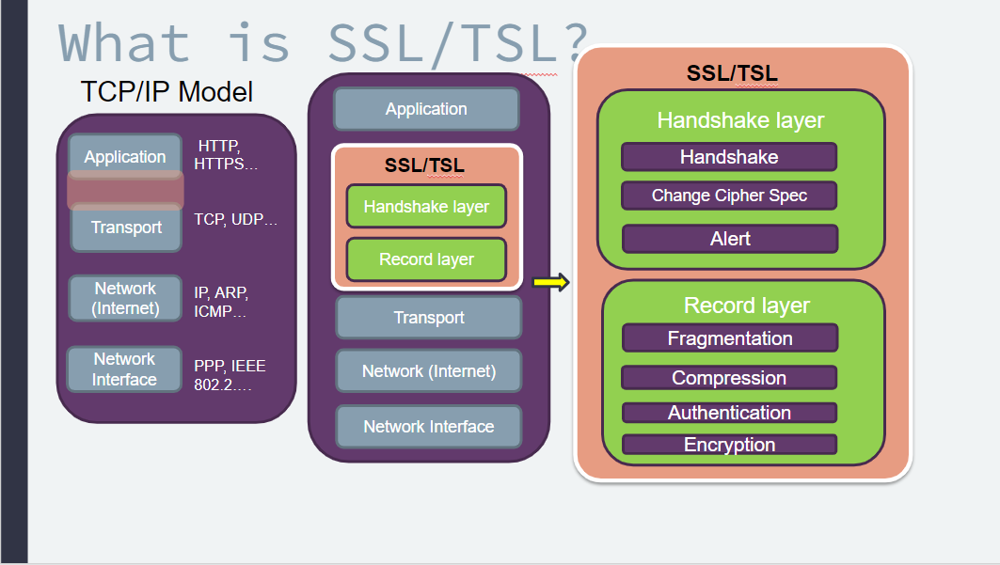
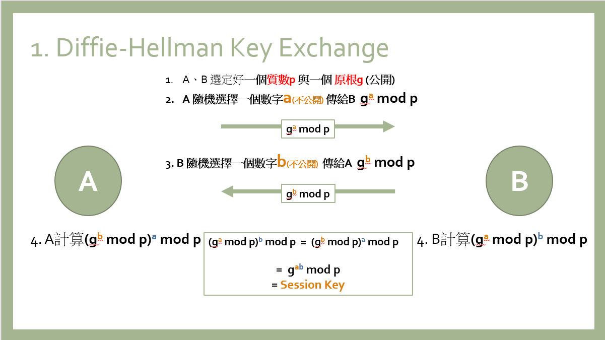
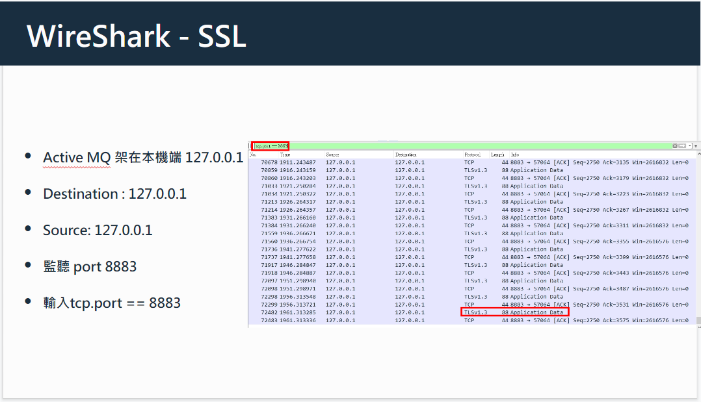

大二下的離散數學課程中的期中報告了解到 Alan Turing 、Enigma machine、Bomb machine 等等的相關歷史與內容，對於加密有了許多的好奇心。
因此在升大三時的暑假至大三上期間，參與了簡宏宇教授的資訊安全實驗室，與教授學習有關於資訊安全的相關內容，學習如何從觀念的學習到真正的實作。以下是我在實驗室中所學習到的:
- 了解 TLS /SSL Handshake
- 使用 ActiveMQ 以及 Mosquitto 開啟 MQTT broker
- 實作使用 Server 端認證，透過 Wireshark 網路封包分析工具檢驗Server 端發送的封包是否有經過 TLS /SSL 加密以及身分認證。

雖然參與實驗室時間不長，但在簡教授的實驗室中，對於研究有初步的了解與概念。以及在研究過程會有許多挑戰自我與瓶頸的出現，面對這些精神上的壓力，也因有了教授的鼓勵與擁有先前的經驗，才能夠將自我狀態調整回來，在研究這條路上注入學生的初衷與熱忱。

| 主題	| 簡報章節內容	 | 簡報連結 |
| -------- | -------- | -------- |
|TLS/SSL|          | [TSL/SSL](https://docs.google.com/presentation/d/1HN_C9U3ydVtoRB5xIt7gEvvFs6GI8O63/edit?usp=sharing&ouid=110711432757985702705&rtpof=true&sd=true)         |
| Diffie-Hellman Algorithm     |          | [Diffie-Hellman Algorithm ](https://docs.google.com/presentation/d/1RW3xgiGlsUmGZK_hOpkg3rfexa8vs_ON/edit?usp=sharing&ouid=110711432757985702705&rtpof=true&sd=true)         |
|   MQTT & TLS/SSL |          | [MQTT & TLS/SSL](https://docs.google.com/presentation/d/1qlRPGsrYIKpzDXyny04tBqIi79bInIuO/edit?usp=sharing&ouid=110711432757985702705&rtpof=true&sd=true)         |